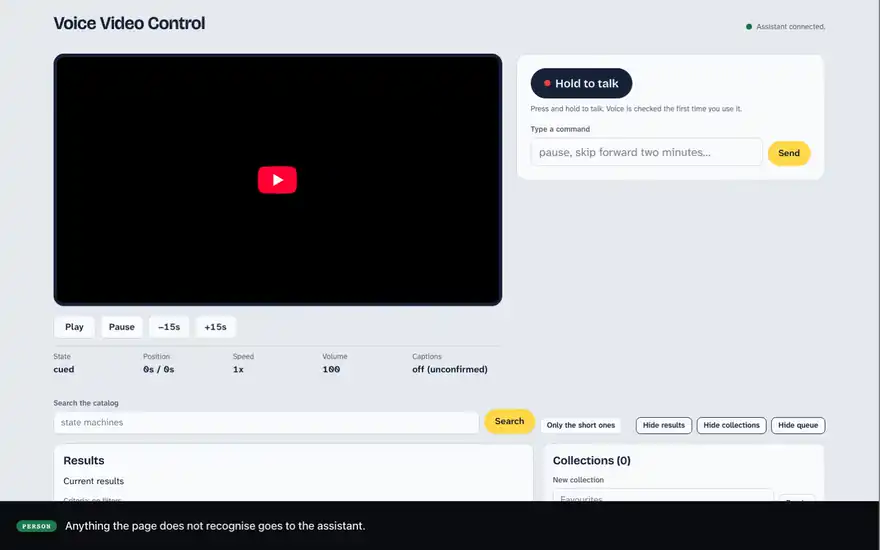

# Adopting `agent-mcp-react` in a real application

**A worked example of [`agent-mcp-react`](https://github.com/A-Launch/agent-mcp-react) beyond the tutorial:** a complete React app — a YouTube library with a player, search, a queue, collections and an activity record — made operable by an AI assistant without browser automation and without a second API. Every pattern below is running code in this repository, including the parts the library deliberately leaves to you.

<a href="docs/media/voice-video-tour-2026-09-14-1151.mp4">
  
</a>

<sub>The app in use: every assistant step is a call to a tool the page declared. [Full recording (MP4)](docs/media/voice-video-tour-2026-09-14-1151.mp4).</sub>

## What the library gives you

- **Your existing actions become the agent's interface.** A tool handler calls the same function a button calls. No parallel REST API to design and keep in sync, and no selectors that break when the markup changes.
- **The agent's reach follows your UI.** A tool exists while the component declaring it is mounted. Close a panel and its tools are gone — the agent cannot act on a view the person cannot see.
- **Input is validated before your code runs.** Each tool declares a JSON schema; a call that does not match it never reaches the handler.
- **A narrow, explicit surface.** Application tools by default; DOM inspection, DOM interaction and JavaScript evaluation are separate capabilities you must spell out, and this app keeps all three off.
- **Every call is observable.** Result and error callbacks report each call that arrives through the library's connection, including ones refused before a handler ran — the basis for an audit trail.
- **Your app stays the owner of its state.** The agent reads and changes it only through handlers you wrote, so there is no second store to reconcile.

## How this app adopts it

### 1. Wrap the app once

The provider makes the page an MCP server that dials out to your gateway. It never holds a credential — it asks your backend for a single-use URL on every connection attempt.

```tsx
// abridged from src/mcp/provider.tsx
<AgentMcpProvider
  connection={{ getUrl: getTicketUrl }}          // POST /api/mcp-ticket → single-use ws:// URL
  server={{ name: 'voice-video-control', version: '0.1.0' }}
  capabilities={{ application: true, dom: { inspect: false, interact: false }, evaluate: false }}
  validation={{ validator: createAjvValidator() }}
  onToolResult={(event) => recordObservedCall(recorder, event)}
  onToolError={(event) => recordObservedCall(recorder, event)}
  onUnexpectedState={(failure) => console.error('[mcp] unexpected state', failure)}
>
  <App />
</AgentMcpProvider>
```

### 2. Declare tools in the component that owns the state

Each view renders its own tool set, so availability is a consequence of what is on screen rather than a check someone has to remember. This app has 34 tools across five views.

```tsx
// src/queue/queue-view.tsx — the queue's tools exist exactly while the queue is shown
<section data-testid="queue">
  <DeclaredTools tools={VIEW_TOOLS.queue} />   {/* queue.add, queue.remove, queue.reorder, queue.clear, queue.get */}
  …
</section>
```

```tsx
// abridged from src/mcp/declared-tools.tsx — one component per tool, so no hook runs in a loop
useMcpTool({
  name: tool,
  description: TOOL_DESCRIPTIONS[tool],
  inputSchema: wireSchema(tool),
  handler: async (args, context) => {
    const result = await actions[tool](command, input, context.signal);   // the same action a button calls
    await context.afterRender();   // the agent's next read must see what this call changed
    return result;
  },
});
```

`context.afterRender()` matters for every mutating tool: without it the handler resolves before React commits, and the agent's next read returns the old state.

### 3. Route buttons and tools through the same actions

A button and a tool call are two callers of one function, so they cannot drift apart — and whatever you build into that function (ordering, confirmation, recording, undo) applies to people and to the agent alike.

```tsx
// abridged from src/App.tsx — the button path
const command = registry.issue(route);
const r = await actions[TOOL.queueAdd](command, { videoIds: [id] });
```

### 4. Put consent inside the handler

The library can ask for confirmation before a tool runs, but that gate covers its own bridge only. A destructive action here asks the person inside the action itself, so the question is the same whoever calls it, and anything but a clear yes refuses.

```ts
// abridged from src/app/tool-actions.ts — curation.removeFromCollection
const question = `Remove ${namedVideos(ids)} from "${name}"?`;
const confirmed = resolveConfirmation(deps.ask(question)) === 'confirmed';   // "maybe" → refused
```

### 5. Tell the agent what to open, not just that it failed

When the agent calls a tool whose view has closed, the refusal names the view. The model can then tell the person what to do instead of guessing.

```ts
// abridged from src/mcp/tool-availability.ts
refuse('view_not_open', `${tool} needs ${view}, which is not open. Open ${view} and try again.`);
```

### 6. Keep an audit trail of every call

Handlers record what they did — outcome, effect, how to undo it. Calls refused before any handler ran (bad arguments, for example) are recorded from the provider's `onToolResult` / `onToolError` observers, so each call becomes exactly one entry, and the agent can answer "what did you just do?" from that record through a tool of its own. See [`src/activity/`](src/activity).

### 7. Say honestly whether the agent is there

`useMcpConnection` drives an "Assistant connected / unavailable" status with the reason, and the whole app keeps working by hand when it is unavailable. See [`src/mcp/connection-status.tsx`](src/mcp/connection-status.tsx).

### 8. Let a person's newer action win over a stale agent call

Agents are slow compared to a click. Every tool's schema carries a reserved `commandId` that the backend fills in for each assistant turn — the model neither sees nor chooses it. Actions are ordered per domain (playback, queue, …), so if a person pauses while the assistant is still deciding to seek, the older seek is refused with the reason rather than applied over the pause. See [`src/mcp/command-id.ts`](src/mcp/command-id.ts) and [`src/app/`](src/app).

## The other half you supply

`agent-mcp-react` is the browser half. This app supplies the three pieces the library leaves to you, as a small Node backend you can read and borrow from:

| Piece | What it does here | Where |
|---|---|---|
| **Ticket minter** | `POST /api/mcp-ticket` issues a single-use, 30-second connection URL bound to the session and tab | [`server/ticket/`](server/ticket) |
| **WebSocket gateway** | Redeems the ticket during the HTTP upgrade — unknown, expired or replayed tickets get `401` before any handshake — then holds one MCP client (`@modelcontextprotocol/client`) per tab | [`server/gateway/`](server/gateway) |
| **Agent runtime** | A Claude tool-use loop that lists the page's tools on every step (cached, and invalidated by the page's `tools/list_changed`), calls them through the gateway, and streams each call to the page | [`server/agent/`](server/agent), [`server/assistant/`](server/assistant) |

Your API keys and any shared quotas live here, never in the browser.

## Try it locally

Requirements: Node 22.18+, a YouTube Data API v3 key and an Anthropic API key.

```bash
npm install
cp .env.example .env        # fill in YOUTUBE_API_KEY and ANTHROPIC_API_KEY
npm run dev:all             # backend on :8787, app on http://localhost:5273
```

Then type into the command box: "find talks about state machines, only the short ones", "play the first one", "queue the second one", "what did you just do?" — and watch each tool call appear under the assistant and in the activity record. Typed playback commands such as "pause" are handled on the page without the assistant; voice works in Chrome with on-device speech recognition.

`npm test` and `npm run test:e2e` run the suites without any keys; the end-to-end suite drives the real page, gateway and turn endpoint with a scripted model.

## Where to look

| To see how to… | Read |
|---|---|
| Configure the provider | [`src/mcp/provider.tsx`](src/mcp/provider.tsx), [`src/mcp/capabilities.ts`](src/mcp/capabilities.ts) |
| Declare tools per view | [`src/mcp/declared-tools.tsx`](src/mcp/declared-tools.tsx), [`src/mcp/tool-descriptions.ts`](src/mcp/tool-descriptions.ts), [`src/mcp/tool-schemas.ts`](src/mcp/tool-schemas.ts) |
| Share actions between buttons and tools | [`src/app/tool-actions.ts`](src/app/tool-actions.ts) |
| Record calls and undo them | [`src/activity/`](src/activity) |
| Mint tickets, run the gateway, run the agent | [`server/ticket/`](server/ticket), [`server/gateway/`](server/gateway), [`server/agent/`](server/agent) |
| Avoid the problems this app hit | [Lessons learned](docs/lessons-learned.md) |
| Read the full design rationale | [`specs/001-voice-video-control/`](specs/001-voice-video-control) |

## License

[Apache License 2.0](LICENSE), like [`agent-mcp-react`](https://github.com/A-Launch/agent-mcp-react) itself.
