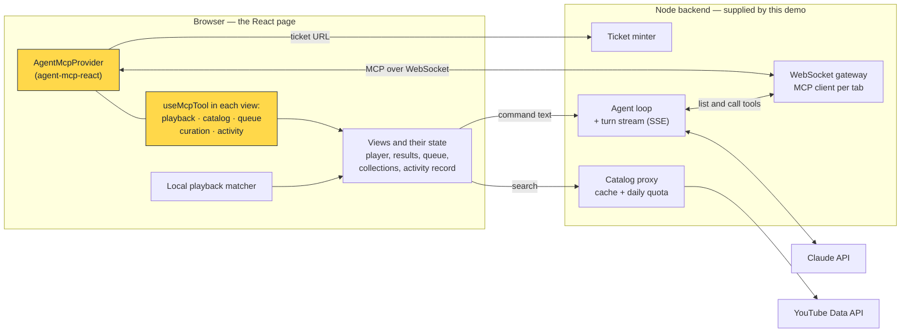

# Voice Video Control — an `agent-mcp-react` demo

**A demo application built on [`agent-mcp-react`](https://github.com/A-Launch/agent-mcp-react) as its engine.** The React page is its own MCP server: every view publishes typed tools with the library, and a Claude assistant drives a YouTube library by calling those tools — from voice or typed commands — instead of automating the browser.

<a href="docs/media/voice-video-tour-2026-09-14-1151.mp4">
  
</a>

**[Watch the full 3-minute tour (MP4)](docs/media/voice-video-tour-2026-09-14-1151.mp4)** — recorded on the running app with the real YouTube player, a real search and the real model. The preview above is a sped-up cut. Every assistant step in it is a tool call the page declared with `agent-mcp-react`.

## The engine: `agent-mcp-react`

[`agent-mcp-react`](https://github.com/A-Launch/agent-mcp-react) exposes a running React application as an MCP server over an authenticated WebSocket — a second control interface onto the same actions the buttons call, not browser automation and not a second store. It is the browser half: the MCP server runs in the tab and connects out to a gateway.

This demo is what that looks like in a complete application. The library does the in-page work:

| `agent-mcp-react` API | What it does in this app | Where |
|---|---|---|
| `AgentMcpProvider` | Turns the page into an MCP server: dials the gateway with a single-use ticket URL, validates every tool input against its schema before a handler runs, and keeps DOM and JavaScript-evaluation tools **off** — the assistant gets application tools only | [`src/mcp/provider.tsx`](src/mcp/provider.tsx) |
| `useMcpTool` | Each view declares its own tools while it is on screen — 34 in all: player (13), results (5), queue (5), collections (8), activity (3). Close a view and its tools are gone; the assistant is told which view to open | [`src/mcp/declared-tools.tsx`](src/mcp/declared-tools.tsx) |
| `onToolResult` · `onToolError` | Observer callbacks feed the activity record, so every call — including one refused before any handler ran — becomes exactly one entry | [`src/mcp/provider.tsx`](src/mcp/provider.tsx) |
| `useMcpConnection` | Drives the "Assistant connected / unavailable" status, with the reason when it is unavailable | [`src/App.tsx`](src/App.tsx) |
| `useMcpTabId` | Routes a tab's ticket and assistant turns to that tab's MCP connection | [`src/main.tsx`](src/main.tsx) |
| `agent-mcp-react/validation` | The Ajv validator the provider requires | [`src/mcp/provider.tsx`](src/mcp/provider.tsx) |

The library leaves three things to the application, and this repository supplies them:

- **A ticket minter** — [`server/ticket/`](server/ticket): a session cookie and single-use connection URLs.
- **A gateway** — [`server/gateway/`](server/gateway): the WebSocket upgrade, and an MCP client per page that lists and calls its tools.
- **An agent runtime** — [`server/agent/`](server/agent) and [`server/assistant/`](server/assistant): a Claude agent loop that sees exactly the tools the page declares right now, streamed to the page as it acts.

Built on top, in the application itself: a local playback matcher, per-domain command ordering, confirmations, undo and the activity record.

## What the demo shows

- **The assistant only acts through declared tools.** "Find talks about finite state machines, only the short ones" becomes `catalog.search`, then `catalog.narrow` — visible on the page as they happen. Narrowing spends no YouTube quota.
- **Playback never waits for a model.** A typed "pause" is matched on the page and applied; the player confirms the state before the page reports it.
- **Your hand beats the assistant.** Ask it to go back, then press pause before it acts: the pause applies, and the assistant's older `playback.seek` is refused with the reason instead of being applied over it.
- **Every tool call is recorded.** By hand or by the assistant, each call lands in the activity record in the page's own words, with Undo where it can be reversed.
- **Discarding asks first, and "maybe" is not yes.** `curation.removeFromCollection` asks the person; anything but a clear yes refuses it.
- **The assistant's account comes from the record** — `activity.describeRecent` — not from its memory of the conversation.

## How it fits together



The highlighted nodes are `agent-mcp-react`. The backend holds what the browser must not: the Anthropic key, the YouTube key and the shared search quota. Voice stays on the device — push-to-talk uses on-device speech recognition only, and the page states what does leave it: command text and video titles go to the model service, searches go to YouTube.

## Run it

Requirements: **Node 22.18+**, a YouTube Data API v3 key, and an Anthropic API key. Voice needs Chrome with on-device speech recognition; everything else works in any modern browser by typing.

```bash
npm install
cp .env.example .env        # then fill in YOUTUBE_API_KEY and ANTHROPIC_API_KEY
npm run dev:all             # backend on :8787 and the page on http://localhost:5273
```

Keys stay in the backend and are never sent to the browser bundle. `.env` and `dev.env` are git-ignored. Assistant spend is capped per session and per day (`ASSISTANT_TURNS_PER_SESSION`, `ASSISTANT_TURNS_PER_DAY`).

## Test it

| Command | What it runs | Needs |
|---|---|---|
| `npm test` | Unit, contract and integration tests (Vitest) — every tool's schema and refusals, the activity record and undo, the gateway on a real socket, the turn stream | nothing |
| `npm run test:e2e` | Playwright against a fake YouTube player and a **scripted** model: every user story, including through the assistant on the real page, gateway and turn endpoint | ports 5273 and 8787 free; spends nothing |
| `npm run test:e2e:live` | The real embed, the real backend and the real model, plus measured response times | both keys; **spends assistant turns and search quota** |
| `npm run typecheck` · `npm run lint` | TypeScript for page and server · ESLint | nothing |

First run: `npx playwright install chromium`.

## Record the demo

With the stack running (`npm run dev:all`):

```bash
node scripts/demo/tour.mjs   # writes .demo/voice-video-tour-<YYYY-MM-DD-HHMM>.mp4
```

Every caption reads what the page actually shows, so a take reflects that run — not a script of what should happen. It spends about seven assistant turns and one search.

## Repository map

| Path | What is there |
|---|---|
| [`src/mcp/`](src/mcp) | The `agent-mcp-react` integration: provider, tool declarations, capabilities, schemas and descriptions |
| [`src/`](src) | The page: `player/`, `catalog/`, `queue/`, `curation/`, `activity/` (each with its view and tool actions), `assistant/` (turn client), `matcher/`, `voice/`, `store/` (IndexedDB), `styles.css` |
| [`server/`](server) | What the library leaves to the app: `ticket/`, `gateway/`, `agent/` (loop, scripted model for tests), `assistant/` (turn endpoint, allowance), plus `catalog-proxy/` |
| [`tests/`](tests) | `contract/`, `integration/`, `e2e/` (fake player, scripted model), `e2e-live/` |
| [`specs/001-voice-video-control/`](specs/001-voice-video-control) | The specification, plan, research decisions, data model, contracts and [quickstart scenarios](specs/001-voice-video-control/quickstart.md) |
| [`scripts/demo/`](scripts/demo) | The recorded tour |
| [`docs/media/`](docs/media) | The demo video, its preview and the social preview image |

## Known limits

- **Search quota is shared:** YouTube allows 100 searches a day for the whole deployment. Narrowing loaded results spends none, and the page shows what remains.
- **The assistant can misjudge.** In one recorded take it replied that the queue was not on screen although all 34 tools were declared, and queued nothing; the page showed exactly that. The same request worked in every other take. Refusals and replies are always shown as they happened.
- **Voice depends on the browser.** Without on-device recognition, voice is refused with the reason.

## License

[Apache License 2.0](LICENSE). [`agent-mcp-react`](https://github.com/A-Launch/agent-mcp-react) is also Apache-2.0.
