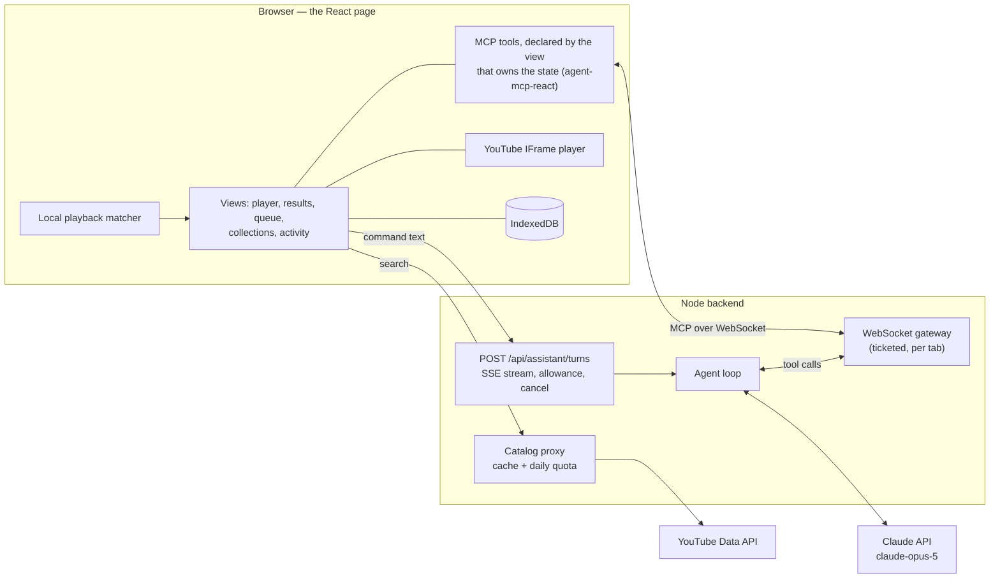

# Voice Video Control

<a href="docs/media/voice-video-tour-2026-09-14-1151.mp4">
  
</a>

**[Watch the full 3-minute tour (MP4)](docs/media/voice-video-tour-2026-09-14-1151.mp4)** — recorded on the running app with the real YouTube player, a real search and the real model. The preview above is a sped-up cut of it.

A YouTube library you drive by typing or speaking. Recognised playback commands ("pause", "skip forward two minutes") are handled on the page at once. Anything else goes to a Claude assistant that acts **only through tools the page itself publishes** with [`agent-mcp-react`](https://github.com/A-Launch/agent-mcp-react) — so the page keeps owning its state, and every action the assistant takes is on screen, recorded, and where possible undoable.

## What the demo shows

- **One request, the fewest calls.** "Find talks about finite state machines, only the short ones" is one search and a narrowing of what was loaded; narrowing spends no YouTube quota.
- **Playback never waits for a model.** A typed "pause" is matched locally and applied; the player confirms the state before the page reports it.
- **Your hand beats the assistant.** Ask it to go back, then press pause before it acts: the pause applies, and the assistant's older seek is refused with the reason instead of being applied over it.
- **Everything is recorded.** Every call — by hand or by the assistant — lands in the activity record in the page's own words, with Undo where an action can be reversed.
- **Discarding asks first, and "maybe" is not yes.** Removing a video from a collection asks for confirmation; anything but a clear yes refuses it.
- **The assistant's account comes from the record**, not from its memory of the conversation.

## How it works



- **Tools live with the state they change.** A view registers its tools while it is on screen and they disappear when it closes; ask for something whose view is closed and the assistant is told which view to open.
- **Commands are ordered per domain.** An assistant action overtaken by a newer command in the same domain (playback, queue, …) is refused rather than applied late.
- **The backend holds what the browser must not:** the Anthropic key, the YouTube key, and the shared search quota (100 searches a day for the whole deployment).
- **Voice stays on the device.** Push-to-talk uses on-device speech recognition only; if the browser cannot promise that, voice is refused and typing still works. The page states what does leave the device: command text and video titles go to the model service, searches go to YouTube.

## Run it

Requirements: **Node 22.18+**, a YouTube Data API v3 key, and an Anthropic API key. Voice needs Chrome with on-device speech recognition; everything else works in any modern browser by typing.

```bash
npm install
cp .env.example .env        # then fill in YOUTUBE_API_KEY and ANTHROPIC_API_KEY
npm run dev:all             # backend on :8787 and the page on http://localhost:5273
```

Keys stay in the backend and are never sent to the browser bundle. `.env` and `dev.env` are git-ignored. Assistant spend is capped per session and per day (`ASSISTANT_TURNS_PER_SESSION`, `ASSISTANT_TURNS_PER_DAY`).

## Test it

| Command | What it runs | Needs |
|---|---|---|
| `npm test` | Unit, contract and integration tests (Vitest) — tool schemas, the activity record and undo, the gateway on a real socket, the turn stream | nothing |
| `npm run test:e2e` | Playwright against a fake YouTube player and a **scripted** model: every user story, including through the assistant on the real page, gateway and turn endpoint | ports 5273 and 8787 free; spends nothing |
| `npm run test:e2e:live` | The real embed, the real backend and the real model, plus measured response times | both keys; **spends assistant turns and search quota** |
| `npm run typecheck` · `npm run lint` | TypeScript for page and server · ESLint | nothing |

First run: `npx playwright install chromium`.

## Record the demo

With the stack running (`npm run dev:all`):

```bash
node scripts/demo/tour.mjs   # writes .demo/voice-video-tour-<YYYY-MM-DD-HHMM>.mp4
```

Every caption reads what the page actually shows, so a take reflects that run — not a script of what should happen. It spends about seven assistant turns and one search.

## Repository map

| Path | What is there |
|---|---|
| [`src/`](src) | The page: `player/`, `catalog/`, `queue/`, `curation/`, `activity/` (each with its view and tool actions), `assistant/` (turn client), `matcher/`, `voice/`, `mcp/` (tool registration), `store/` (IndexedDB), `styles.css` |
| [`server/`](server) | `gateway/`, `assistant/` (turn endpoint, allowance), `agent/` (loop, scripted model for tests), `catalog-proxy/`, `ticket/` |
| [`tests/`](tests) | `contract/`, `integration/`, `e2e/` (fake player, scripted model), `e2e-live/` |
| [`specs/001-voice-video-control/`](specs/001-voice-video-control) | The specification, plan, research decisions, data model, contracts and [quickstart scenarios](specs/001-voice-video-control/quickstart.md) |
| [`scripts/demo/`](scripts/demo) | The recorded tour |
| [`docs/media/`](docs/media) | The demo video, its preview and the social preview image |

## Known limits

- **Search quota is shared:** YouTube allows 100 searches a day for the whole deployment. Narrowing loaded results spends none, and the page shows what remains.
- **The assistant can misjudge.** In one recorded take it replied that the queue was not on screen although it was, and queued nothing; the page showed exactly that, and a plainer request worked. Refusals and replies are always shown as they happened.
- **Voice depends on the browser.** Without on-device recognition, voice is refused with the reason.
